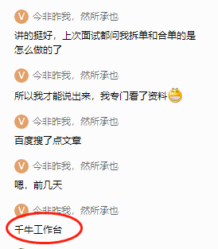

# 零基础项目实训

# 方法：

先确保方案的简单可用，再考虑通用性和复用性。我们做的大部分都是专用系统。

越通用越没用。

追求完美，作为一个程序员，是人格缺陷。

不要实现所有的需求。

技术债务。

维护流程的畅通。开发，测试，运维。

# 商品中心

揪头发（把自己拔高）

京东，淘宝 spu和sku的 重视度不同？

淘宝减少 存储空间。多个sku共享一个详情页。

京东重视sku，更精细化以下，用户体验好。便于物流管理。

淘宝的商品量级：亿级，ioe。ibm，Oracle，emc存储

京东：百万级。

商品中心两部分：买家：多样化展示；管理端：方便管理，或者流转。

## 基本概念

SKU：Stock Keeping Unit: 库存保存单元。库存控制的最小可用单位。iphone12 plus 128g。它有多少个，库存。

SPU: Standard  Product  Unit：标准化产品单元。iphone12  （品牌苹果）。

spu是sku的大集。

sku  能对应 几个 spu？

一条白色花边xxxx修饰裤子=sku，对应2个spu：1. 七分裤夏季薄款运动休闲，2.男士大码小脚潮。xxx更多的。

买家也得关心sku。

| 商品          | 订单数量 | sku  | 组合sku              | 仓库发货sku     |
| ------------- | -------- | ---- | -------------------- | --------------- |
| 确定的桌子    | 1        | sku1 |                      | 1*sku1          |
| 确定的凳子    | 1        | sku2 |                      | 1*sku2          |
| 一套饭桌 套餐 | 1        | sku3 | 1*sku1 + 4*sku2（1） | 1*sku1 + 4*sku2 |

合单和拆单。

# 类目

大型电商系统是拆分开的。

10个分类：

## 后台类目：

基础数据：让系统看的。sku必须绑定 后台类目。后台类目差不多固定。

层次不要太深：三层。最多4层。对技术和管理都是好的。

叶子类目：商品必须挂在叶子类目下。

## 前台类目：

让消费者看的。便于用户查看和搜索的。

pc，h5，app端，展示的类目是不一样的。（客户端来源）

确定映射关系：1:1, 1:n, m:n。

头纱/公主风

饰品/白色

多对多2天，1对1：半天。

----

类目设计

